# Blue Team Incident Response & Remediation Lab

## 📌 Overview

This lab simulates a real-world attack lifecycle involving vulnerability discovery, exploitation, remediation, and validation. The primary focus was exploiting and mitigating the **Shellshock vulnerability (CVE-2014-6271)** on a vulnerable Apache CGI service.

The lab demonstrates hands-on experience with:

- Network attack simulation
- Vulnerability identification
- Manual exploitation using Metasploit
- Malware detection with ClamAV
- Patch deployment
- Post-remediation validation

This project mirrors real-world blue team and SOC workflows.

---

# 🖧 Lab Topology

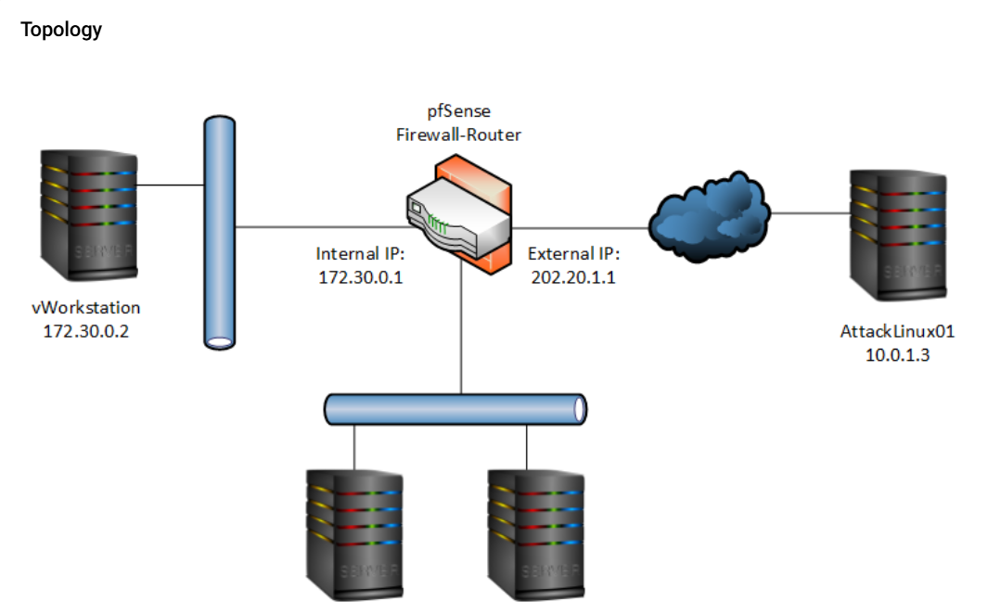

## Infrastructure Breakdown

| Component        | Role |
|------------------|------|
| pfSense          | Firewall/Router |
| Internal IP      | 172.30.0.1 |
| External IP      | 202.20.1.1 |
| vWorkstation     | 172.30.0.2 (Target System) |
| AttackLinux01    | 10.0.1.3 (Attacker Machine) |

The attacker resides outside the internal network and attempts exploitation through exposed services.

---

# 🔎 Phase 1 – Automated Attack Simulation

## 1️⃣ Infection Monkey Execution

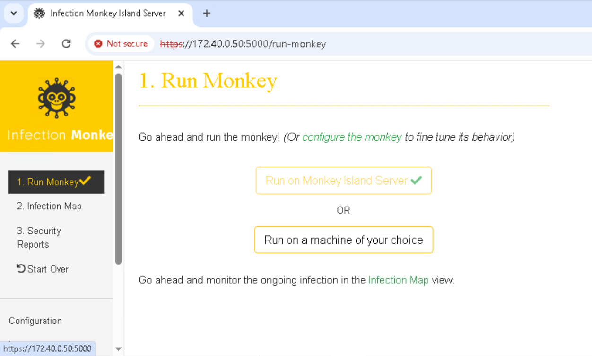

Infection Monkey was executed to simulate automated lateral movement and vulnerability discovery across the network.

The tool scanned for:
- Open ports
- Weak configurations
- Exploitable services
- Attack paths

---

## 2️⃣ Vulnerability Discovery

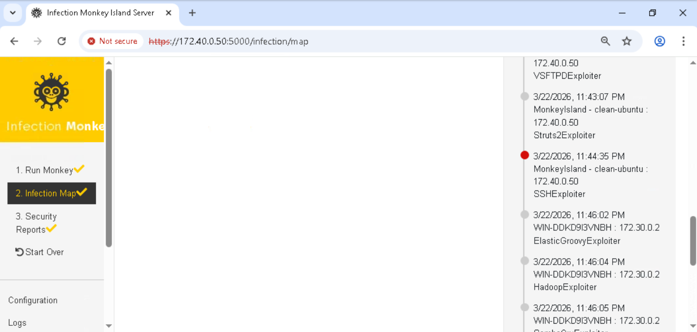

The scan identified multiple weaknesses including:

- Shellshock (CVE-2014-6271)
- Exposed web services
- Weak service configurations

This confirmed the system was susceptible to remote exploitation.

---

## 3️⃣ Infected File Detection (EICAR Test)

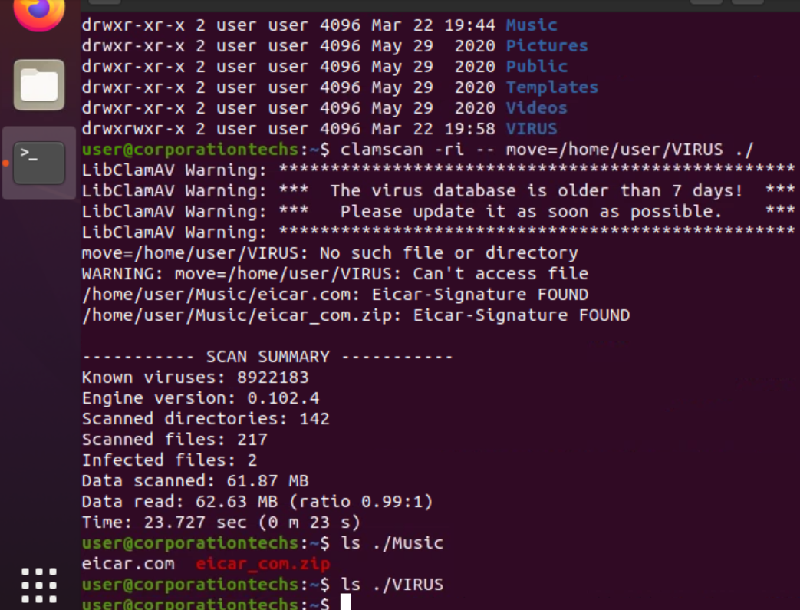

Simulated malware (EICAR test files) were used to validate detection capabilities.

Detected:
- `eicar.com`
- `eicar_com.zip`

This confirmed endpoint detection was functioning correctly.

---

## 4️⃣ ClamAV Scan Summary

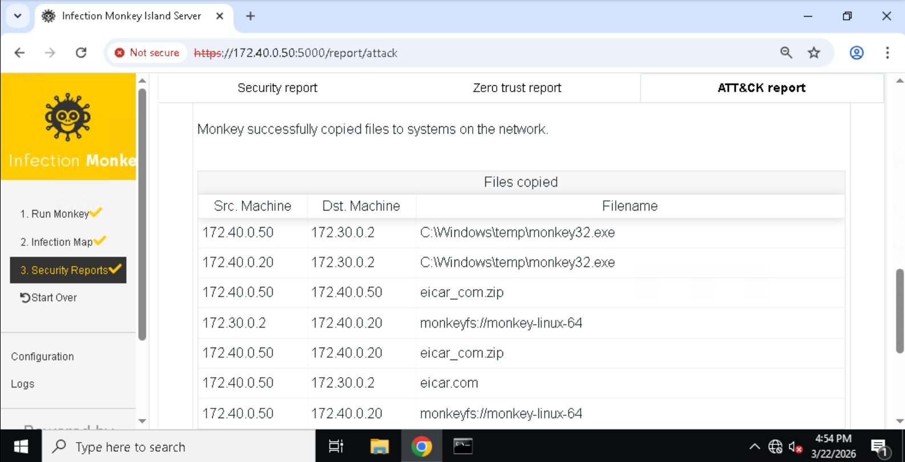

A recursive scan was executed across the filesystem.

Results:
- 217 files scanned
- 2 infected files detected
- Detection engine functioning properly

---

## 5️⃣ Attack Report Overview

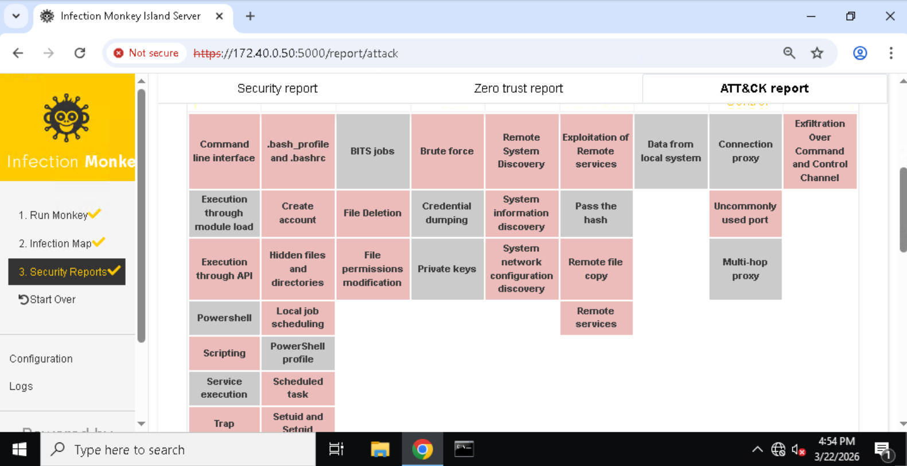

The attack report provided:

- Exploitation pathways
- Compromised nodes
- Vulnerability risk ratings
- Attack surface analysis

This simulates SOC-level attack reporting.

---

## 6️⃣ Security Recommendations

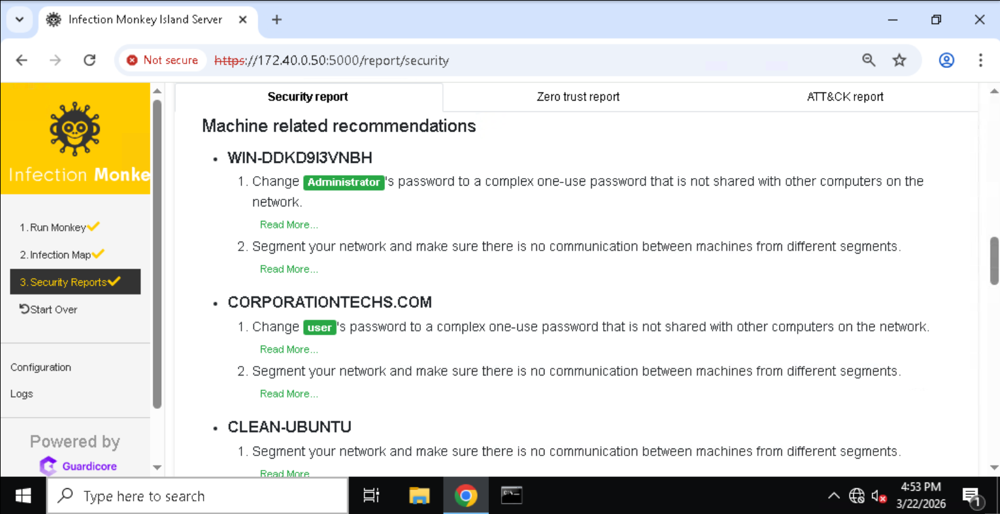

Recommended mitigation steps included:

- Patch vulnerable services
- Update outdated Bash packages
- Harden exposed services
- Restrict unnecessary network exposure

---

# 🔥 Phase 2 – Manual Exploitation (Shellshock)

## 7️⃣ Searching for Shellshock Module

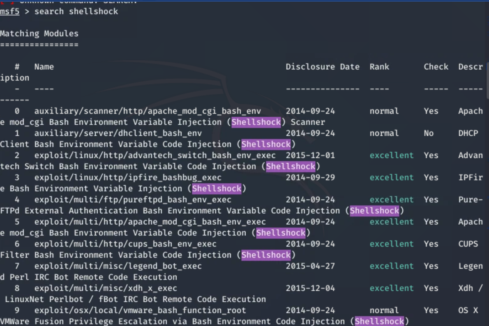

Metasploit was used to search for Shellshock-related exploit modules targeting Apache mod_cgi.

---

## 8️⃣ Module Configuration

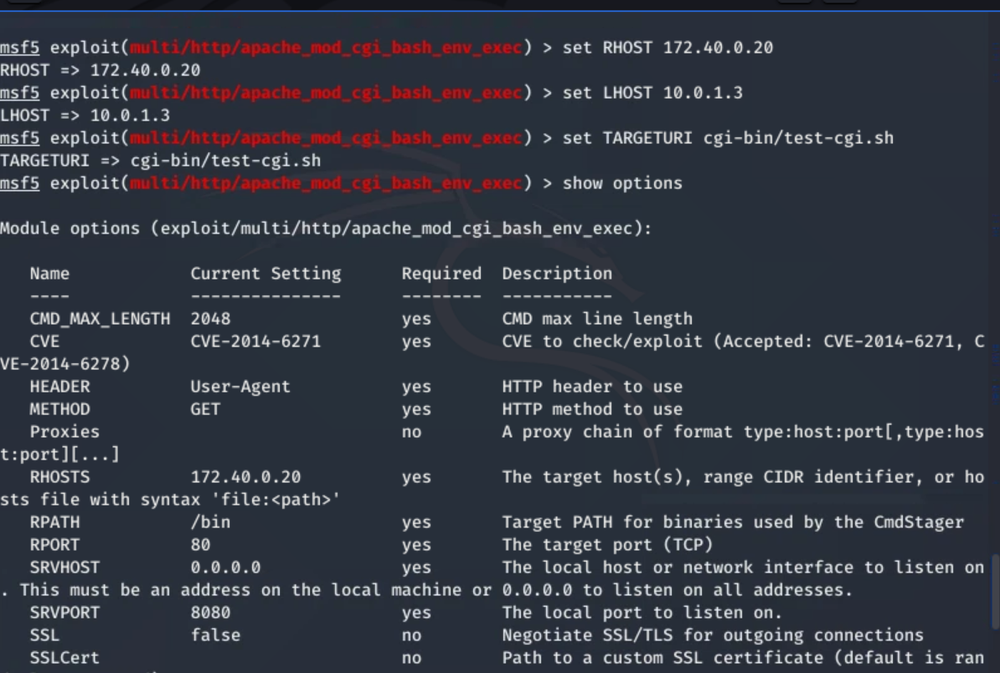

The module was configured with:

- `RHOST` → Target IP
- `LHOST` → Attacker IP
- `TARGETURI` → `/cgi-bin/test-cgi.sh`
- Reverse TCP payload

Proper configuration ensured exploit reliability.

---

## 9️⃣ Module Options Verification

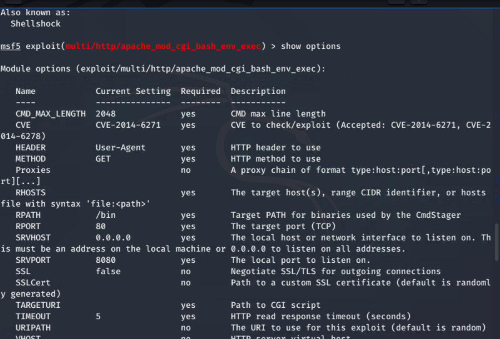

Verified:
- Target port 80
- Correct payload selection
- Reverse TCP handler enabled

Configuration validated prior to execution.

---

## 🔓 10️⃣ Successful Exploitation

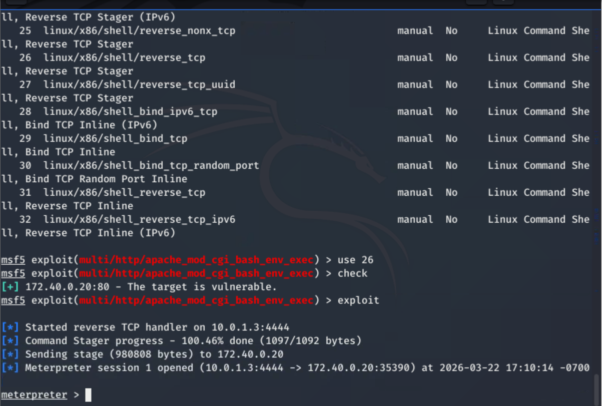

Results:

- Reverse TCP handler started
- Meterpreter session established
- Remote shell access obtained

This confirmed the system was vulnerable to CVE-2014-6271.

---

## 11️⃣ Post-Exploitation Validation

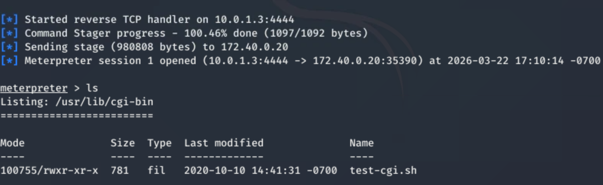

Using Meterpreter, the CGI directory was enumerated.

Confirmed presence of:

- `test-cgi.sh`

This validated the exploitation path and confirmed access to the vulnerable service.

---

# 🛠 Phase 3 – Vulnerability Remediation

## 12️⃣ Bash Patch Installation

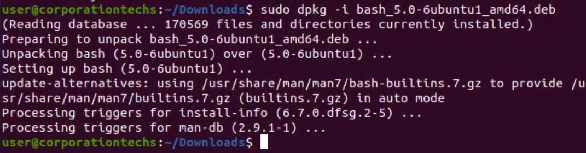

The vulnerable Bash package was upgraded using:
sudo dpkg -i bash_5.0-6ubuntu1_amd64.deb

This mitigated the Shellshock vulnerability by patching the underlying Bash environment variable injection flaw.

---

# ✅ Phase 4 – Post-Remediation Validation

## 13️⃣ Exploit Retest – Target Not Exploitable

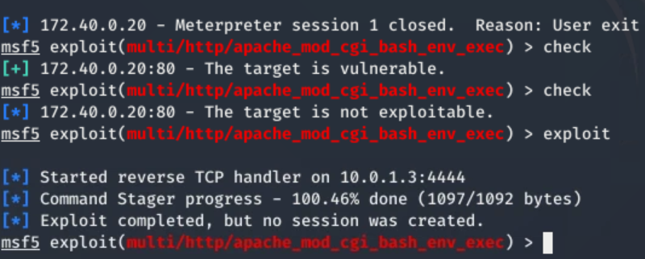

After patching:

- Re-ran exploit check
- Target reported: **"The target is not exploitable"**
- No session created

This confirmed successful remediation.

---

# 🧠 Incident Response Lifecycle Demonstrated

This lab demonstrates the full defensive workflow:

1. Detect vulnerabilities  
2. Validate exploitability  
3. Perform exploitation analysis  
4. Patch the vulnerability  
5. Retest to confirm mitigation  

---

# 🧰 Technologies Used

- pfSense
- Metasploit Framework
- Infection Monkey
- ClamAV
- Linux (Ubuntu)
- Apache mod_cgi
- Bash

---

# 🎯 Key Takeaway

This project reflects real-world blue team operations involving:

- Vulnerability management
- Exploit validation
- Patch deployment
- Security verification
- Incident documentation

It demonstrates the ability to not only identify vulnerabilities, but also remediate and validate security improvements — a critical skill for SOC and security engineering roles.
